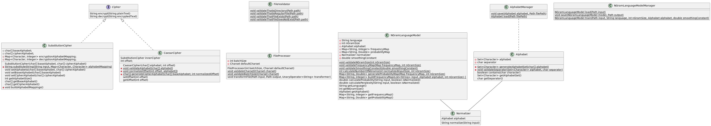

= Cryptology Project

== Requirements

- Write a program that works with Caesar ciphers.
- The lexicographic alphabet consist of all letters of the English alphabet as well as punctuation marks (.,":-!?SPACE).
Characters that not belong to the lexicographic alphabet should be ignored.

=== Mandatory requirements

The program should have two modes:

1. **Encription/decryption.** The program must encrypt and decrypt text using a given cryptographic key.
The program should receive a path to a text file containing source text and create a file containing the corresponding ciphertext.

2. **Cryptoanalyisis by brute force attack**
In this mode, the program must crack the ciphertext contained in an input text file.

If the user selects brute force, then the program must independently enumerate the possible keys, select the correct key, and decrypt the text.

=== Additional requirements

1. **Cryptoanalysis by statistical analysis**

The user should be able to choose one of two cryptanalysis methods.
If the user selects statistical analysis mode, then prompt the user to load an additional text file in plaintext, preferably by the same author and in the same style.
Based on the contents of the second file, the program should compile statistics on the occurrence of characters and then try to use these statistics to perform cryptanalysis of the ciphertext.

2. **User interface**

Make dialog boxes for interaction with the user at your discretion.
If desired, you can use the Swing and JavaFX graphic frameworks.

== Implementation design

=== Class diagram

